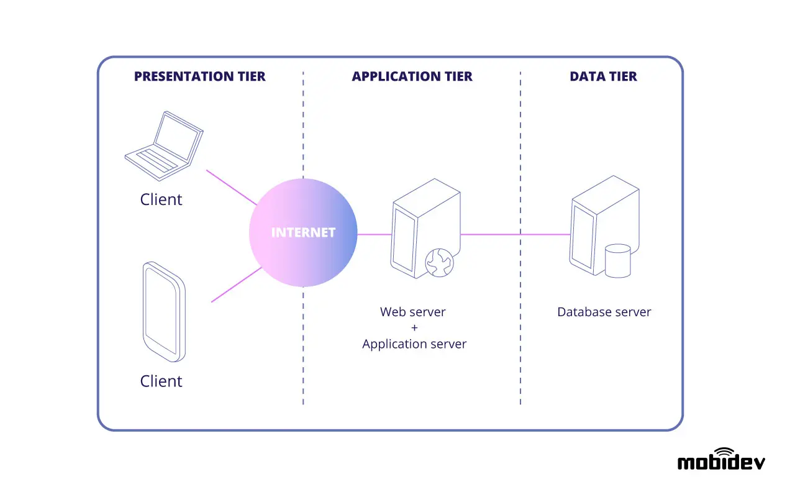

# Itp460 Class Website Application Technical Documentation

## Overview
ITP460 class website serves as the classpage, All class materials will be posted by instructor to students before each class begins.

## System Architecture


## Technologies
1. [NodeJS](https://nodejs.org)
2. ReactJS
3. ExpressJS
4. MangoDB
5. [AWS](https://aws.amazon.com)
    * Login using following crendentials
      > username: bo@usc.edu
      > password: 123456
    * Server IP: 56.87.12.45
    * etc,

## Coding Guidelines
We are using *MVC model* to manage our codes
```
# Example of how a variable should named, lowerUpperUpper , make it readable
var parentPortal
# Example of a function name. lowerUpperUpper.
function offerStudentReward(){
}
```

This is a good example :+1: :boom:

## Setup
To setup your local development environment
- [x] Install commandline on your computer, use terminal if you are using mac computer
- [ ] Install NodeJS
- [ ] Install MangoDB
- [ ] More...。
